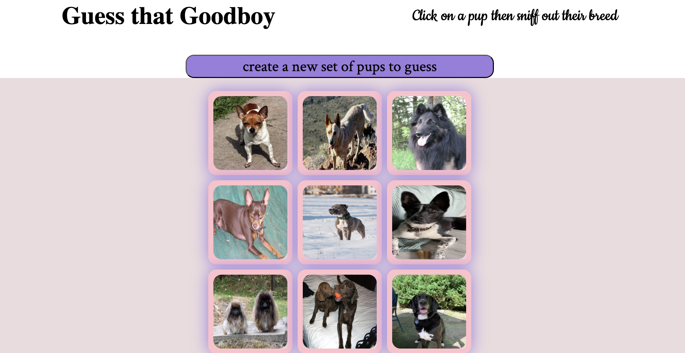

<h1 align="center">Guess That Goodboy!</h1>

<strong>Innovation Final Phase Project</strong>
 

<h2>Objective</h2>

- Browser-based puppy guessing game using [dog API](https://dog.ceo/dog-api/) ,vanilla js, and css.
  
## Inspo

As a petsitter and dog lover, spotting pups in the wild is one of my favorite things. I thought it might be fun for myself and others test their doggie knowledge while enjoying cute doggos to relieve stress.

<h2>Assignment</h2>

> [Instructions](https://docs.google.com/document/d1ru1Apd9dbrMy-tY4e05f8fTmaOYX0J24XRd8vUnLsUM/edit?usp=sharing) 

### Setting up App
- fork project
- download project folder
- navigate to inside of project folder using your terminal
- (install npm if it isn't already) 
- use npm in terminal to install vite:
  - "npm create vite@latest"
  - then follow prompts
- to run server, enter : 
  - "npm run dev" 
- (use CTRL + c to stop server when needed)

### How to play
- press "create new set of pups to guess" button to create gameboard grid
- click on any of the 9 dog images to open a dialog that will show you the picture exclusively and make a guess which breed it is using the 4 buttons below
- The dialog title will inform you of correct and incorrect guesses and then close itself after 5 seconds
- you can proceed to try your hand at guessing the other dogs, or go back to previous one to study like a digital flashcard
- Whenever you would like more "goodboys" to guess, click the same "create..." button above and a new gameboard grid will appear.

### Submission summary:
- Repo (@ Canvas)
- Netlify deployment (@ Canvas)
- final product image ( diplayed on top of READme and can be found in public folder)
- READme (found here)

    
<h2>Project status</h2>
Completed

<h2>Credits</h2>

- Coded by: <a href="https://www.linkedin.com/in/nikolewis/)" target="_blank">Niko Lewis</a>
- Dog images credit to Dog API
- Sorting algorithm learned from [Modern Javascript Tutorial](https://javascript.info/)
<h2>Copyright 2025</h2>
This project is licensed under the terms of the MIT license
 and protected by The Knowledge House Honor Code and Community Code of Conduct.