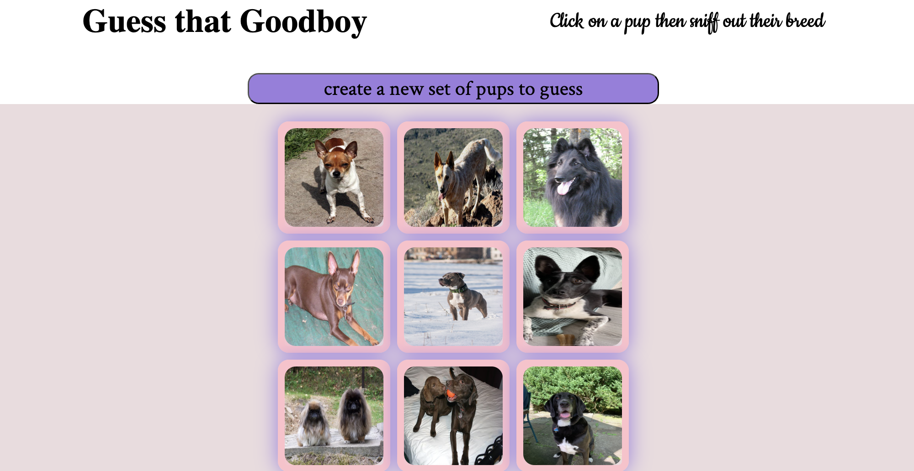

<div align="center"></div>
<h1 align="center">Guess That Goodboy!</h1>
<p align="center"><strong>Innovation Final Phase Project</strong>
<br/>

# 🐾 Guess That Good Boy!

> **"Who's that... Good Boy?!"** 🎾

Welcome to **Guess That Good Boy**, the ultimate test of your canine knowledge! This interactive web app fetches random pups from the Dog API and challenges you to identify the correct breed. Do you know your Terriers from your Retrievers? Come fetch some high scores!

---

## 🦴 Fetch The Demo

| Resource | Link |
| :--- | :--- |
| **Play the Game** | [**https://guess-that-goodboy.netlify.app/**](https://guess-that-goodboy.netlify.app/) |
| **The Repo** | [**github.com/NikoLewis/guess-that-goodboy**](https://github.com/NikoLewis/guess-that-goodboy) |

---

## ✨ Features (The Treats)

* **Real-Time Fetching:** We use the [Dog CEO API](https://dog.ceo/dog-api/) to grab a fresh, random "Good Boy" (or Girl!) for every round.
* **Streak Tracking:** keep your momentum going! The game tracks your correct answers in a row. How high can you go before you get stumped by a Labradoodle?
* **Responsive Design:** Play on your phone while walking your dog, or on your desktop.
* **Instant Feedback:** Know immediately if you're a Top Dog or if you need to go back to obedience school (just kidding, try again!).

---

## 🛠️ Under The Hood (Tech Stack)

Built with love (and code) using:

* **React:** For a snappy, interactive UI that feels like a game.
* **CSS / Tailwind:** Styling that keeps things clean and friendly.
* **Fetch API:** To retrieve our furry friends asynchronously.
* **Netlify:** For seamless deployment.

---

## 💻 How to Run (Sit, Stay, Run)

Want to run this locally? Follow these commands:

1.  **Clone the Repo** (Come here, boy!):
    ```bash
    git clone [https://github.com/NikoLewis/guess-that-goodboy.git](https://github.com/NikoLewis/guess-that-goodboy.git)
    cd guess-that-goodboy
    ```

2.  **Install Dependencies** (Get the treats):
    ```bash
    npm install
    ```

3.  **Start the App** (Zoomies!):
    ```bash
    npm start
    ```
    Open [http://localhost:3000](http://localhost:3000) to view it in your browser.

---

## 📬 Bark At Me

Got feedback? Found a bug? Just want to talk about dogs?

* **Email:** `nikolewis@pursuit.org`
* **GitHub:** [@NikoLewis](https://github.com/NikoLewis)

---

*Made with 💜 and 🐕 by Niko Lewis*


 

